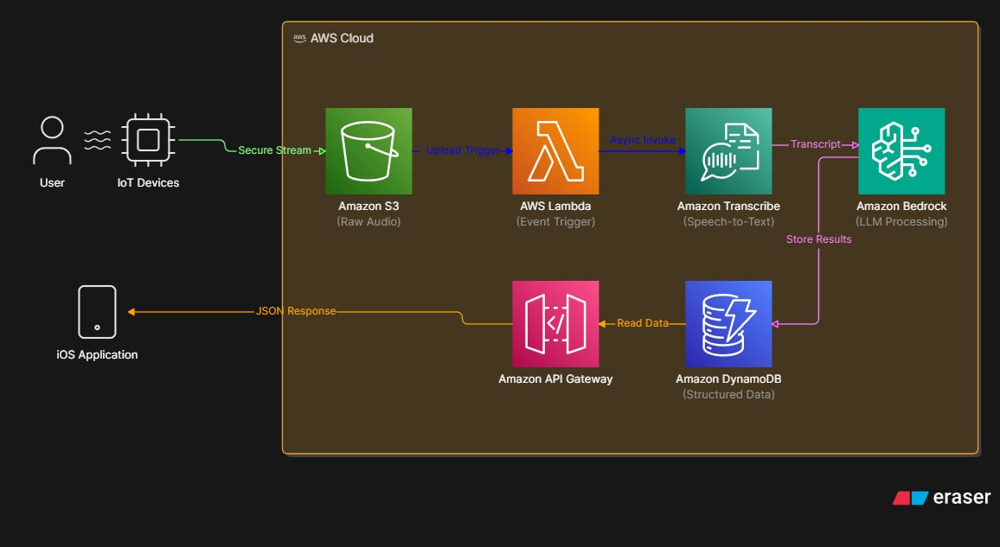

# CloudMic: Serverless IoT Audio Ingestion & AI Semantic Analysis Pipeline

CloudMic is a serverless backend and companion iOS application designed to capture, process, and analyze speech from IoT microcontrollers. The system converts raw audio, transcribes it, runs semantic analysis via AI models in Amazon Bedrock, and updates a mobile dashboard.

---

## 🏗️ High-Level Cloud Architecture

The pipeline uses a completely serverless event-driven architecture on AWS to handle scaling and cost efficiency.




### Key Stages:
1. **Secure Ingestion**: IoT devices fetch authorization keys to stream raw audio recordings directly and securely to Amazon S3.
2. **Audio Pipeline**: Uploaded audio is processed and transcribed asynchronously using event-driven Lambda triggers and Amazon Transcribe.
3. **AI Semantics**: Large language models hosted on Amazon Bedrock process the speech transcript to extract topics, executive summaries, takeaways, action items, and Q&A answers.
4. **Data Sync**: The structured results are stored in Amazon DynamoDB and served to the iOS application via API Gateway.

---

## 🌟 Key Features

* **IoT-Ready Ingestion**: Presigned secure URLs allow memory-constrained hardware to upload data without storing persistent credentials.
* **Semantic Analysis**: Extract key intelligence, summaries, and action steps automatically.
* **Assistant Q&A**: Detects questions asked in the audio and embeds corresponding AI-generated answers directly in your feed.
* **Modern Grayscale UI**: Native iOS SwiftUI application designed with high-contrast grayscale palettes, featuring interactive detail tabs and swipe-to-refresh sync.

---


## 🚀 Setup & Deployment Overview


### Infrastructure Deployment
The infrastructure is configured via Terraform. To deploy:
1. Initialize Terraform plugins:
   ```bash
   terraform init
   ```
2. Build the cloud stack:
   ```bash
   terraform apply
   ```

### iOS Application Setup
1. Open the Swift project in Xcode:
   ```bash
   open the CloudMicApp.xcodeproj
   ```
2. Update your API Gateway endpoint constant in `ConversationViewModel.swift`.
3. Set your developer signing team under target properties, compile, and run on your device.